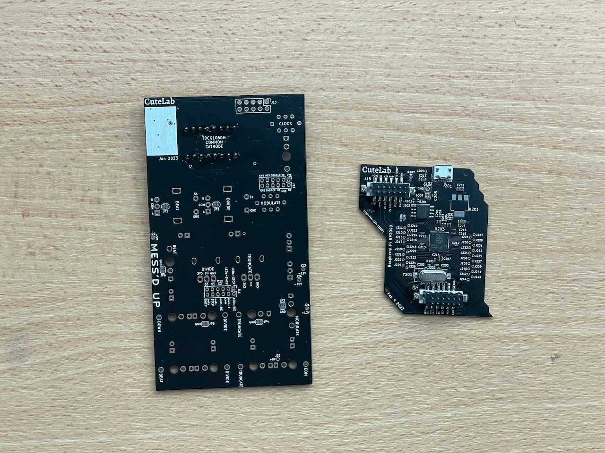
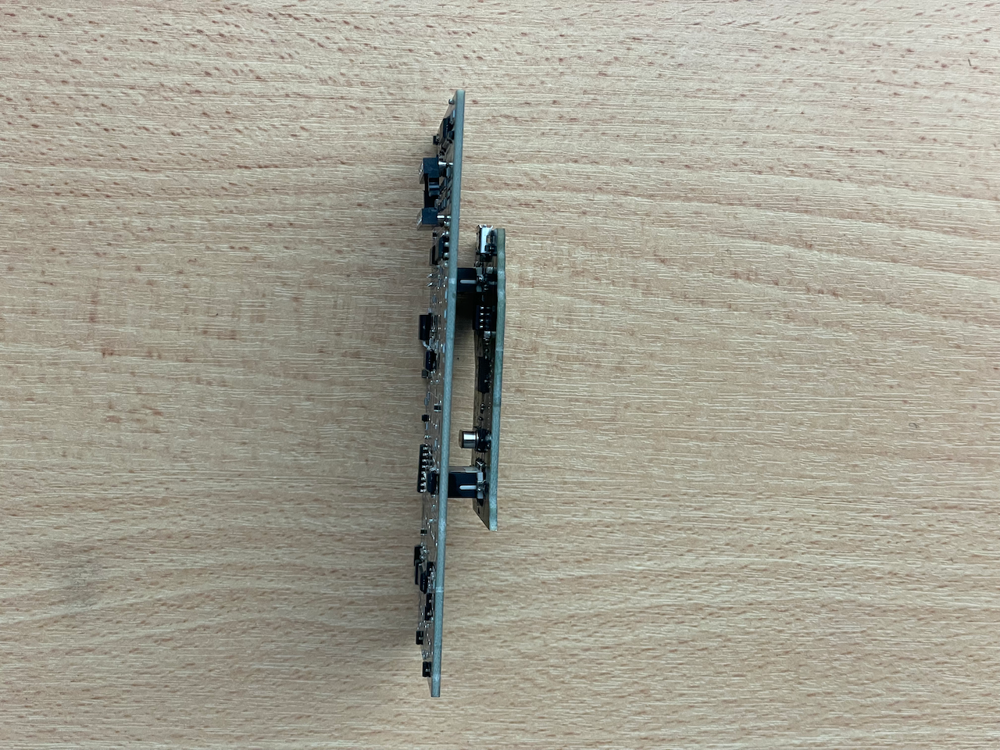
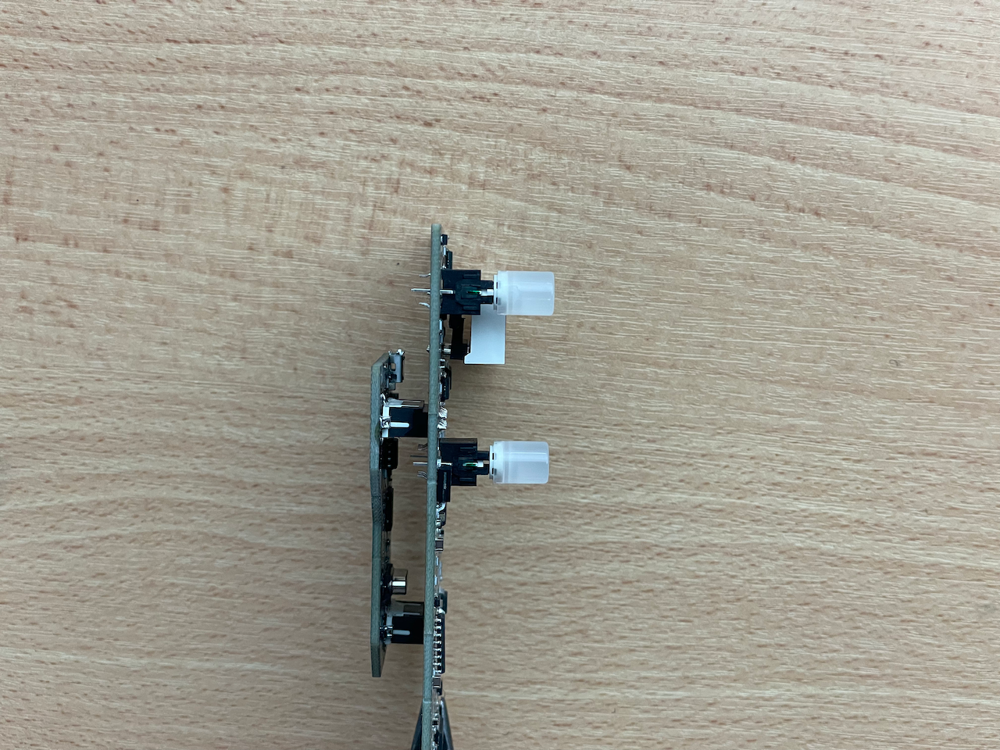

# messedup-diy
DIY Build Instructions for Messed Up

Your kit should contain:

- 1 PCB layer 1
- 1 PCB layer 2
- 1 Messed Up aluminum face panel
- 1 2x5 2.54mm pin header
- 2 2x6 2mm locking pin headers
- 2 2x6 2mm locking pin sockets
- 2 SPDT toggle switches
- 2 pushbutton switches
- 2 pushbutton encoders
- 1 9mm D-shaft potentiometer
- 1 9mm trimmer potentiometer
- 10 PJ398 jacks ("Thonkiconn")
- 10 jack nuts
- 5 green LEDs
- 2 yellow LEDs
- 1 ribbon cable

## Building

### 1. Interconnect pin sockets.

Start with the smaller PCB and the two white pin sockets.

Make sure the side with an extra plastic ridge is facing towards the top of the PCB, where the USB connector is located.

The pin sockets are locking, and have polarity.

### 2. Display pin sockets.

For the display, we use a 16-pin (2x8) IC socket.

Since the display is wider than a normal IC, break it in half first.

### 3. Interconnect pin headers.

Next, take the two black shrouded pin headers.

To ensure they fit correctly, connect them to the bottom board before soldering.

### Optional: Solder the power header.

If you want, you can solder the power header (J13).

However, we usually wait to the end, since the header can get in the way.

### 4. Place the display in the socket.

But if you're worried about damaging it, wait until you've finished everything else.

### 5. Fit the pushbutton switches.

These switches include an LED, which has a polarity.

The pin marked in green is the cathode of the LED. Follow the markings on the silkscreen to place it correctly.

The switches should stay in place on their own. But you can solder one pin to hold them in place.

### 5. Prep the pot and encoders.

First, remove the washers and nuts.

Then use a pair of pliers to trim off the small stability pin on top.

The small trimmer pot has not nut, washer, or stability pin.

### 6. Fit the pots, encoders, and toggle switches.

As with the buttons, you can solder one leg of each if you like.

However, do not solder all pins until later (when the panel is added), or they could turn out very crooked.

### 7. Fit the jacks.

This part can be a little tricky, because the jacks fit loosely. But it's best to avoid soldering them until the panel is added.

The two shrouded pin headers should allow you to lay the PCB flat on the table while you insert the jacks.

### 8. Fit the LEDs.

LEDs have multiple polarity markings. The flat side of of the casing marks the cathode. The shorter leg also marks the cathode. VERY rarely, an LED is made incorrectly and these don't line up. In that case, you'll need to look at the Anvil and Post inside the case/lens to confirm the polarity.

The cathode of the LED should be placed in the square hole on the PCB.

### 8. Fit the panel.

This is probably the hardest part of the build. To make sure that everything lines up perfectly, you want to fit the panel while all the components are still loose. To do this, keep the PCB and panel parallel to the ground. Place the panel over the components, and press down with your thumbs while holding the PCB in place with your other fingers.

Once the panel is at least partially in place, you should be able to hold the panel and PCB together with once hand. Then you can use your other hand to nudge all the components into place.

Once you do, add nuts for a few of the jacks and for the truncate potentiometer. This will be enough to hold everything in place.

The panel holes are a bit tight for the "round" and "free" toggle switches. Don't be afraid to use some force to push the panel into place. It should rest flatly across all the jacks.

### 9. Solder the controls and jacks.

With nuts fitted, you can flip over the PCB, allowing the LEDs to fall into place. Before soldering, make sure each LED has found its place.

### 10. Solder the power header.

Once everything is soldered, remove the nuts and the panel so you can solder the power header. The power header is a 2x5 2.54mm unshrouded pin header. We avoid shrouded power connectors because they provide false confidence: ribbon cables with backwards connectors aren't uncommon. Instead, our modules have clear markings and reverse-polarity protection.

It may seem counter-productive to fit the panel, then remove it. But the power header is longer than the shrouded headers, so it's harder to fit all the components when it's soldered, since the PCB won't lay parallel to the table/ground.

### 11. Fit the panel (again).

Now that the power header is soldered, you can fit the panel and add all the nuts. Make sure not to overtighten the nuts for the encoders. They're partly held into place by the mounting pins.

### 12. Fit the knobs.

The pots and encoders are D-shaft, so you simply need to press down on the knobs to fit them.

### 13. Add the jumper.

If you have a very early version of Messed Up, you'll need to add this 2-pin header and jumper in order to program the module.

With your kit, we probably provided a right angle header. If you have a straight header, bend the pins so they don't press against the upper PCB.

### 14. Program the module.

To program Messed Up, follow our programming guide.
