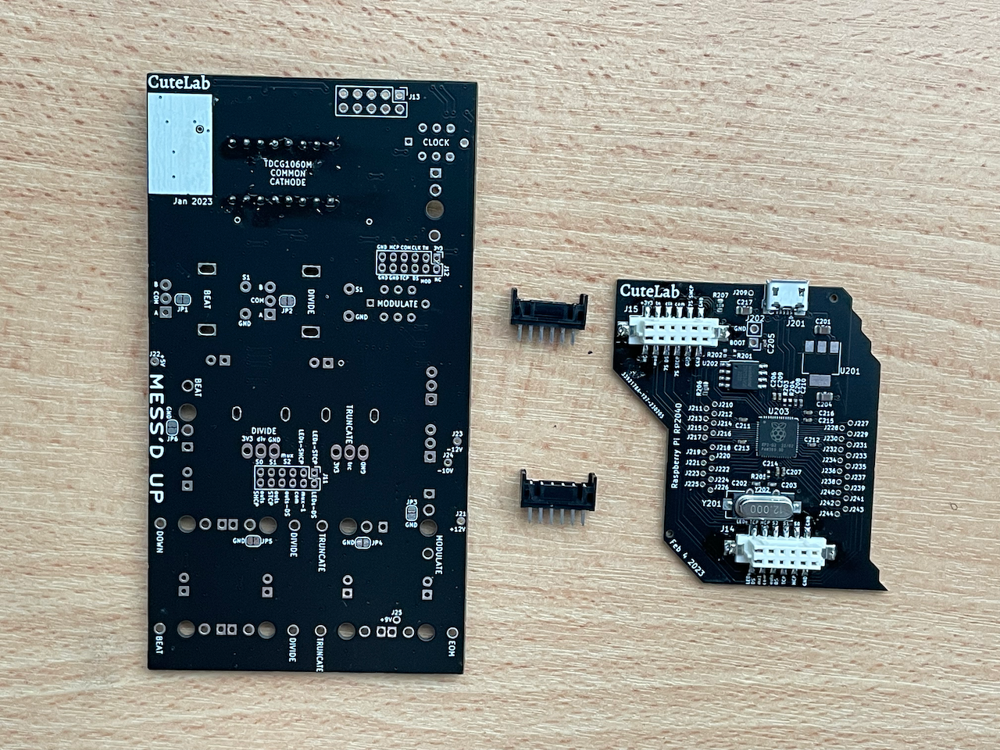
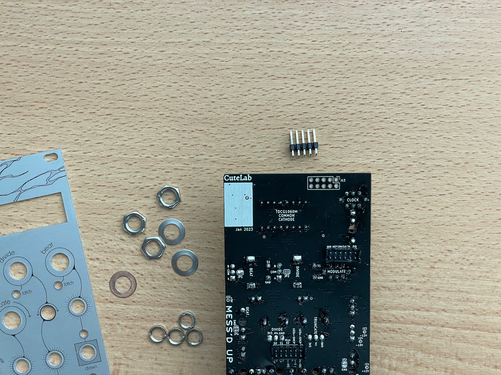
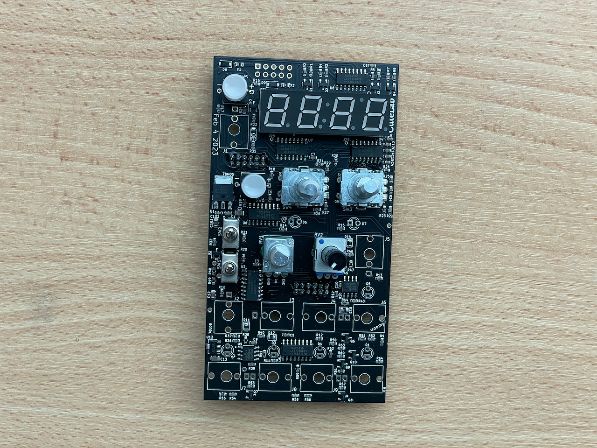
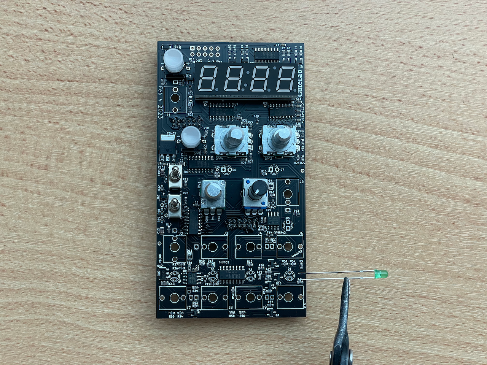
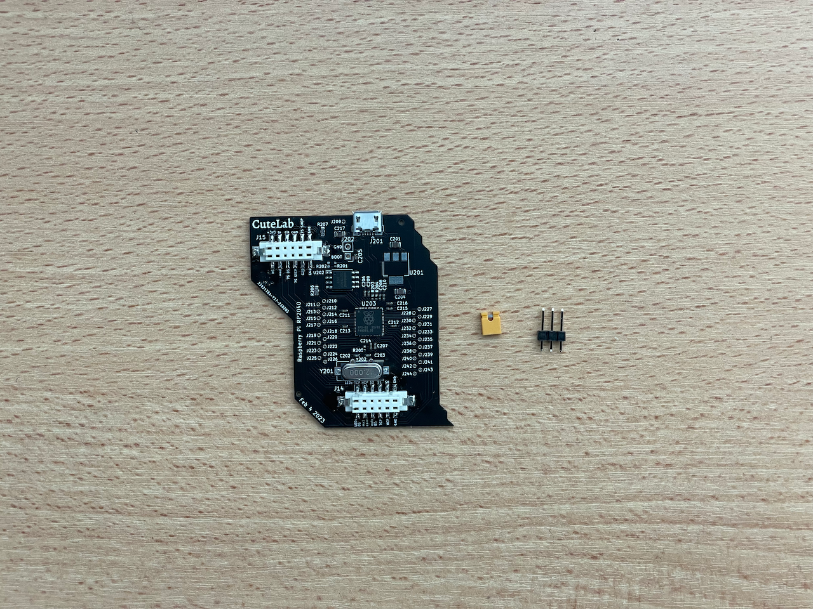
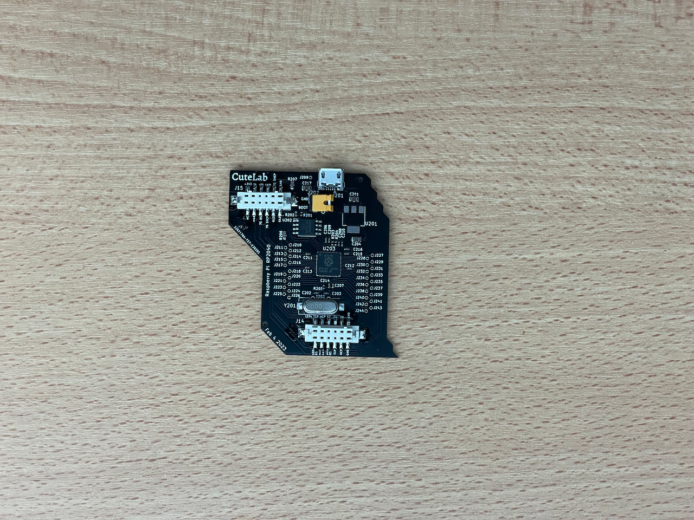

# messedup-diy
DIY Build Instructions for Messed Up

Your kit should contain:

- 1x PCB layer 1
- 1x PCB layer 2
- 1x Messed Up aluminum face panel
- 1x 2x5 2.54mm pin header
- 2x 2x6 2mm locking pin headers
- 2x 2x6 2mm locking pin sockets
- 4x digit 7 segment display
- 1x 2x8 2.5mm IC socket
- 2x SPDT toggle switches
- 2x pushbutton switches
- 2x pushbutton encoders
- 1x 9mm D-shaft potentiometer
- 1x 9mm trimmer potentiometer
- 10x PJ398 jacks ("Thonkiconn")
- 10x jack nuts
- 5x green LEDs
- 2x yellow LEDs
- 2x skirted encoder knobs (with caps)
- 1x unskirted potentiometer knob (with cap)
- 1x trimmer cap
- 1x ribbon cable

Kits from April 2023 onwards also contain:
- 1x 2x6 2mm right-angle pin header

> [!TIP]
> We've made a few PCB revisions to MessedUp since January 2023.
You may see small differences in the SMD parts, and some may be added or missing. This is intentional.
The THT parts are basically identical between versions, and any THT differences will be noted as they arise.

> [!NOTE]
> In early kits (early-2023), the rear PCB (the little one)
may come pre-assembled.

## Building

### 1. Interconnect pin sockets.

In some of our earlier kits, the rear PCB will come pre-assembled, so you can skip this step.

Start with the smaller PCB and the two white pin sockets.

Both sides have a thin ridge in the plastic casing, but only one side has two thin lines in the ridge.

The pin sockets are locking, and have polarity. Those thin lines must fit into the black shrouded headers in step 3.

Make sure the side with the two thin lines is facing towards the top of the PCB, where the USB connector is located.

On early PCBS, you might find

### 2. Display pin sockets.

For the display, we use a 16-pin (2x8) IC socket.

Since the display is wider than a normal IC, break it in half first. Be careful not to break it too quickly or forcefully, or the part with pins might break too.

### 3. Interconnect pin headers.

Next, take the two black shrouded pin headers.

To ensure they fit correctly, connect them to the bottom board before soldering.

### Optional: Solder the power header.

If you want, you can solder the power header (J13).

However, we usually wait to the end, since the header can get in the way during the other steps.

The power header is the a straight connector with 10 positions (two rows of five). The pins are spaced 2.54mm apart. More recent kits also contain a right angle header. The right angle header uses a smaller 2.0mm pin spacing, preventing it from being used for power accidentally.

### 4. Place the display in the socket.

But if you're worried about damaging it, wait until you've finished everything else.

### 5. Fit the pushbutton switches.

> [!IMPORTANT]
> These switches include an LED, which has a polarity.

The pin marked in green is the [cathode](img/led-polarity-diagram-20240328-2.png) of the LED. Follow the markings on the silkscreen to place it correctly.

The switches should stay in place on their own. But you can solder one pin to hold them in place if you prefer.

### 5. Prep the pot and encoders.

First, remove any washers and nuts.

On the potentiometer, use a pair of pliers to trim off the small stability pin on top. Make sure it's entirely removed, so the panel can sit flat against the pot. Otherwise it can cause other components to be mis-aligned.

The encoders have stability pins too, but they don't need to be removed.

The small, black-shaft trimmer pot has no nut, washer, or stability pin.

### 6. Fit the pots, encoders, and toggle switches.

As with the buttons, you can solder one leg of each if you like.

However, do not solder all pins until later (when the panel is added), or they could turn out very crooked.

### 7. Fit the jacks.

This part can be a little tricky, because the jacks fit loosely. You might be tempted to solder a pin on each jack to keep them in place. Doing that will keep the jacks flush, but they can still be off-center. So it's best to avoid soldering them until the panel is added.

The two shrouded pin headers should allow you to lay the PCB flat on the table while you insert the jacks.

### 8. Fit the LEDs.

> [!IMPORTANT]
> Be careful of LED orientation!

LEDs have a polarity, and will not work if connected backwards. Luckily, they won't be damaged if you do, so you can reverse them if you make the mistake. But it's easy to damage the board or parts while fixing the mistake, so it's best to get it right from the start.

The cathode of the LED should be placed in the square hole on the PCB.

LEDs have multiple polarity markings, which are show in our [LED Polarity Guide](img/led-polarity-diagram-20240328-2.png). Here's the same info in text form: the flat side of of the casing marks the cathode. The shorter leg also marks the cathode. VERY rarely, an LED is made incorrectly and these don't line up. In that case, you'll need to look at the Anvil and Post inside the case/lens to confirm the polarity.

D1-D5 are green LEDs. D6 and D7 are yellow LEDs. You can use different color LEDs if you want, but the resistor values for each LED were chosen for the original colors, so the brightness will vary.

### 8. Fit the panel.

This is probably the hardest part of the build. To make sure that everything lines up perfectly, you want to fit the panel while all the components are still loose. To do this, keep the PCB and panel parallel to the ground. Place the panel over the components, and press down with your thumbs while holding the PCB in place with your other fingers.

Once the panel is at least partially in place, you should be able to hold the panel and PCB together with once hand. Then you can use your other hand to nudge all the components into place.

Once you do, add nuts for a few of the jacks and for the truncate potentiometer. This will be enough to hold everything in place.

The panel holes are a bit tight for the "round" and "free" toggle switches. Don't be afraid to use some force to push the panel into place. It should rest flatly across all the jacks.

### 9. Solder the controls and jacks.

With nuts fitted, you can flip over the PCB, allowing the LEDs to fall into place. Before soldering, make sure each LED has found its place.

### 10. Solder the power header.

Once everything is soldered, remove the nuts and the panel so you can solder the power header. The power header is a 2x5 2.54mm unshrouded pin header. We avoid shrouded power connectors because they provide false confidence: ribbon cables with backwards connectors aren't uncommon. Instead, our modules have clear markings and reverse-polarity protection.

It may seem counter-productive to fit the panel, then remove it. But the power header is longer than the shrouded headers, so it's harder to fit all the components when it's soldered, since the PCB won't lay parallel to the table/ground.

### 11. Fit the panel (again).

Now that the power header is soldered, you can fit the panel and add all the nuts. Make sure not to overtighten the nuts for the encoders. They're partly held into place by the mounting pins.

### 12. Fit the knobs.

The pots and encoders are D-shaft, so you simply need to press down on the knobs to fit them.

### 13. Add the jumper.

If you have a very early version of Messed Up, you'll need to add this 2-pin header and jumper in order to program the module.

With your kit, we probably provided a right angle header. If you have a straight header, bend the pins so they don't press against the upper PCB.

### 14. Program the module (usually not necessary).

> [!NOTE]
> If your rear PCB came pre-assembled, your chip was already programmed. So you don't need to program it.

> [!IMPORTANT]
> MessedUp modules marked Apr23 (April 2023) or earlier require eurorack power to be connected in order to to program, in addition to a USB cable. Modules with more recent dates can be programmed with only a USB cable.

Using a personal computer, the RP2040 chip that powers Messed Up can be programmed by mounting the drive as a disk and dropping in a file. The `upload` folder contains the `firmware.elf` and `firmware.uf2` files. You should only need `firmware.uf2`, but the elf file is provided too, in case you want it.

1. Remove the rear panel from your Messed Up.

2. Find the Boot and Ground pins, and attach a jumper to pull Boot to Ground. Now when the device is powered on, it's ready for programming.

3. Connect the rear panel to Messed Up.
4. Connect the Messed Up module to your computer using a USB cable. The USB cable is for data only and won't power the module, so you won't see anything on your computer yet.

5. Connect the Messed Up module to 12v rack power. This can be a little tricky with the USB cable in place, but not too bad.

6. Now, with the rack powered, the RP2040 should mount as a drive.
7. Find the `firmware.uf2` file from the `upload` directory in this repository, and copy it to the mounted RP2040 drive. The drive should disappear after you copy over this file.

8. Unpower your Messed Up and disconnect the USB cable.
9. Remove the rear panel again and remove the jumper.
10. Connect the rear panel again. You're ready to power on Messed Up. At this point, everything should work correctly. You can verify that the display works, that the encoders change the value of beats and divide, and that the LEDs illuminate correctly. The last step is to calibrate the inputs.

## Calibrate the module (necessary).

Once Messed Up is assembled, the last step is to calibrate the inputs. Messed Up needs to record the voltage reading of each input when nothing is corrected, in order to establish a zero volt baseline. To calibrate Messed Up, first make sure that nothing is connected to any of Messed Up's inputs. Next, with Messed Up powered off, hold down both the Beat and the Divide encoder. With both encoders held down, power on the module (this can be a little tricky). Once the module powers on, keep the encoders held down until you see the module display "CALI". Once that happens you can let go of the encoders. Power the module off and then restart it. If everything worked correctly, you should see the module display 07:04, which means that all of the inputs are reading zero volts.

Congratulations! Your Messed Up is ready.
