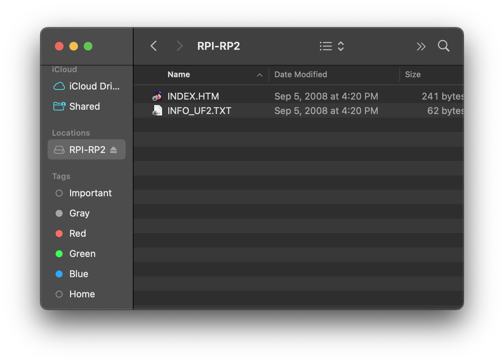

# Programming 

This folder contains the `firmware.elf` and `firmware.uf2` files. You should only need `firmware.uf2`, but the elf file is provided too, in case you want it.

1. Remove the rear panel from your Messed Up.

2. Find the Boot and Ground pins, and attach a jumper to pull Boot to Ground. Now when the device is powered on, it's ready for programming.

3. Connect the rear panel to Messed Up. 
4. Connect the Messed Up module to your computer using a USB cable. The USB cable is for data only and won't power the module, so you won't see anything on your computer yet.

5. Connect the Messed Up module to 12v rack power. This can be a little tricky with the USB cable in place, but not too bad.

6. Now, with the rack powered, the RP2040 should mount as a drive.
7. Find the `firmware.uf2` file from the `upload` directory in this repository, and copy it to the mounted RP2040 drive. The drive should disappear after you copy over this file.

8. Unpower your Messed Up and disconnect the USB cable.
9. Remove the rear panel again and remove the jumper.
10. Connect the rear panel again. Your Messed Up is ready!
